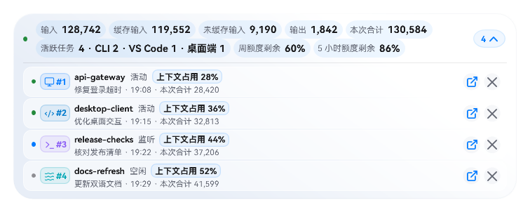
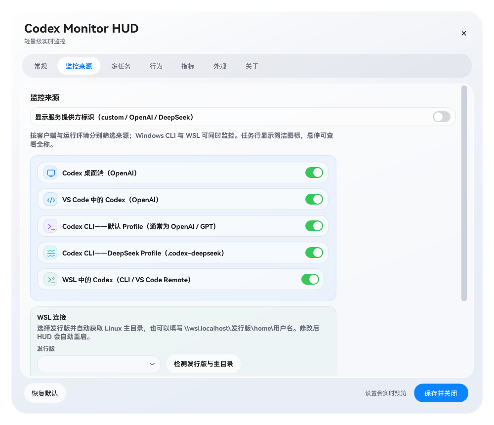
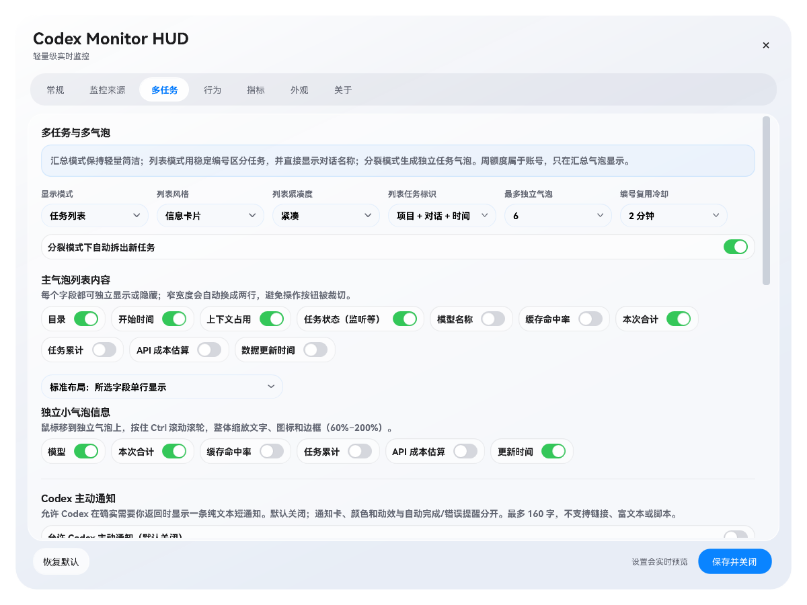
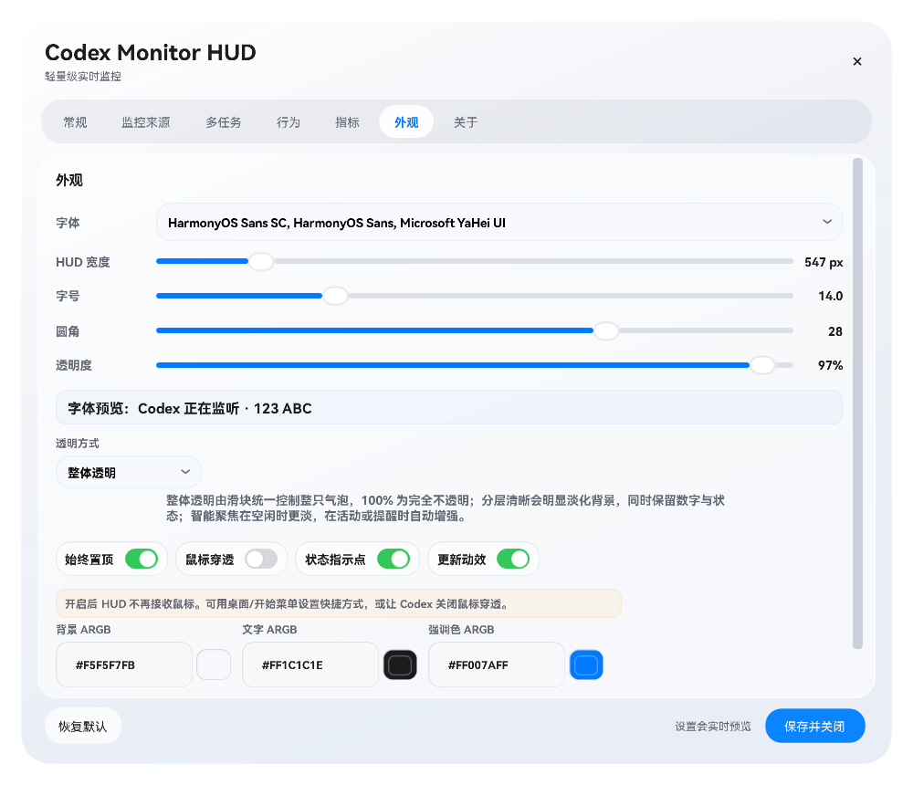
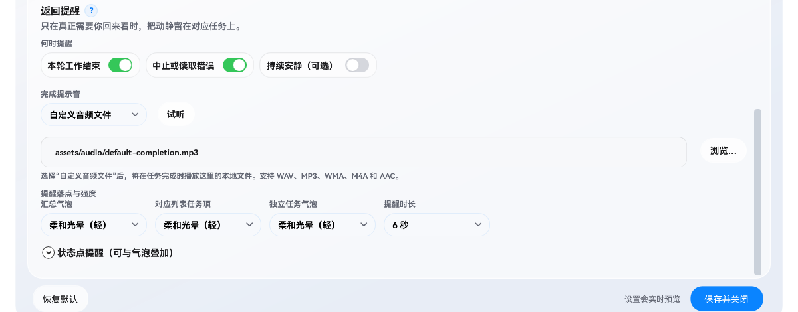

# Codex Monitor HUD

<p align="center">
  
</p>

<p align="center">
  A local, lightweight Windows HUD for Codex Desktop, VS Code, Windows CLI, and WSL.<br>
  <a href="README.zh-CN.md">简体中文</a> · English
</p>

Codex Monitor HUD shows live task state, token usage, context pressure, allowances, and source identity without uploading session data. It supports a compact floating ball, an expandable window, task lists, and detached task bubbles.

## Download and run

Download the latest stable assets from [GitHub Releases](https://github.com/wassamriehlei/codex-monitor-hud/releases/latest).

| Package | How to run | Data location |
| --- | --- | --- |
| `CodexMonitorHUD-Portable-3.4.3-windows-x64.zip` | Extract all files, then double-click `CodexMonitorHUD.exe` | `portable-data\CodexMonitorHUD` beside the EXE |

Before first run, install Microsoft's [.NET 10 Desktop Runtime](https://dotnet.microsoft.com/download/dotnet/10.0) for **Windows x64**. Choose **Desktop Runtime**, not the SDK or ASP.NET Core Runtime.

Open Settings from the HUD or notification-area menu. The Portable release contains only `CodexMonitorHUD.exe`, with no separate Settings EXE, public CMD launcher, installer, or private runtime folder. Keep the extracted directory writable and do not run the EXE from inside the ZIP.

The package includes the default completion sound. A .NET SDK is not required after the Desktop Runtime prerequisite is installed. Verify the download with `SHA256SUMS.txt`; the current binary is not code-signed, so Windows may show an unknown-publisher prompt.

To upgrade, exit the HUD, retain the existing `portable-data` directory, replace the other files with a fully extracted new release, then put `portable-data` back beside the EXEs.

## Highlights

- Monitors Codex Desktop, Codex in VS Code, native Windows Codex CLI, WSL Codex CLI, and an optional isolated DeepSeek CLI profile.
- Shows active, listening, idle, paused, completed, aborted, and read-error states.
- Displays cached and uncached input, output, reasoning, call/task totals, context usage, model, provider badge, weekly allowance, and 5-hour allowance.
- Lets every main-list field be shown or hidden independently.
- Supports summary, list, split-bubble, and floating-ball modes.
- Expands the floating ball on click or after a short hover; dragging does not trigger expansion. It expands toward the available side of the screen.
- Provides state-aware color, pulse, breath, pop, shake, and settle animation cues.
- Supports adjustable HUD width, floating-ball size, whole-bubble scaling, opacity, corners, edge snapping, and any installed Windows font. HarmonyOS Sans SC is preferred by default.
- Plays a built-in completion sound or a user-selected WAV, MP3, WMA, M4A, or AAC file.
- Offers opt-in current-user startup and a local MCP control surface.

## Screenshots

| Floating ball | Expanded task list |
| --- | --- |
|  |  |

| Windows, CLI, and WSL sources | Multi-task fields and layout |
| --- | --- |
|  |  |

| Appearance, font, and width | Completion sound and reminders |
| --- | --- |
|  |  |

The floating ball shows only the active-task count. Its foreground and low-cost background motion follow task state; click it or hover briefly to expand the full HUD.

## WSL Codex CLI

Open **Settings → Sources**, enable WSL, select a distribution, and use automatic home detection. Windows and WSL profiles can run at the same time and be toggled independently. The native Windows HUD reads the selected WSL session directory through `\\wsl.localhost\...`; it does not need a second Linux GUI process.

See [the WSL setup guide](docs/WSL_CODEX_CLI.md) for profile discovery and troubleshooting.

## Install from the repository

Give Codex this repository URL and say **“Install this for me.”** The deterministic flow is documented in [INSTALL_WITH_CODEX.md](INSTALL_WITH_CODEX.md) and [install-manifest.json](install-manifest.json).

Manual developer install:

```powershell
powershell.exe -NoProfile -ExecutionPolicy Bypass -File .\scripts\install.ps1
```

Build the Windows AppHost and private runtime:

```powershell
powershell.exe -NoProfile -ExecutionPolicy Bypass -File .\scripts\build-dotnet.ps1
```

The build creates the single framework-dependent `CodexMonitorHUD.exe` entry point at the repository root. `scripts/prepare-release.ps1` creates only the versioned Portable ZIP, uses smallest-size compression, and removes its temporary stage automatically. PDB/CMD files, private runtime copies, development projects, tests, toolchains, and user data stay out of the archive.

## Privacy

All processing stays local. The HUD reads only bounded session metadata and counters needed for the display: usage, model/provider label, client source, lifecycle events, workspace leaf, session ID, and local title. It does not store prompts, replies, tool output, transcripts, credentials, or provider configuration, and it does not modify Codex session files. There is no HUD telemetry.

See [PRIVACY.md](PRIVACY.md), [SECURITY.md](SECURITY.md), and [THIRD_PARTY_NOTICES.md](THIRD_PARTY_NOTICES.md).

## Platform and project status

- Windows 10/11 x64 is packaged and tested.
- The project is independent and unofficial; it is not affiliated with or endorsed by OpenAI, Microsoft, DeepSeek, or Apple.
- The interface is a lightweight WPF interpretation of the iOS 26 visual language. It does not use the retired Windows Blur/Acrylic glass mode.
- The mascot portrait was generated for this project; its prompt and processing notes are recorded in the third-party notice.

MIT License.
