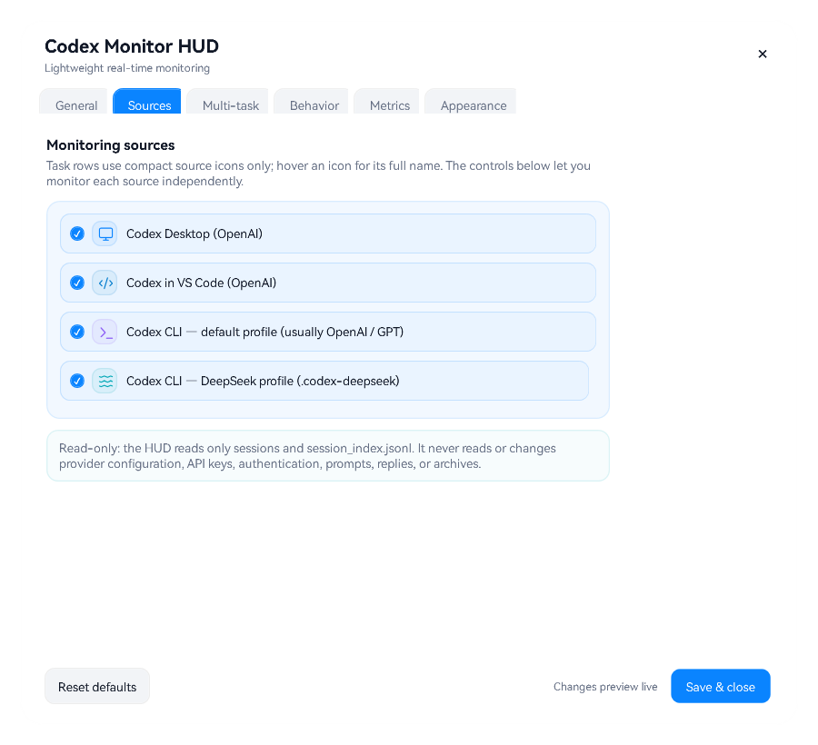

# Codex Monitor HUD

> [简体中文](README.zh-CN.md) · Windows x64 only

Codex Monitor HUD is a local, real-time Windows overlay for the Codex work that is active now: Codex Desktop, Codex in VS Code, the normal Codex CLI profile (usually OpenAI/GPT), and an optional isolated DeepSeek CLI profile. It is deliberately a monitor, not a chat archive, billing dashboard, or cloud service.

## Install with one short prompt

Give Codex this repository URL and say: **“Install this for me.”**

The repository includes [INSTALL_WITH_CODEX.md](INSTALL_WITH_CODEX.md) and [install-manifest.json](install-manifest.json). A capable agent can detect Windows x64, select a verified Release when one is available, preserve settings, health-check the installation, and retain a rollback copy. It must not inspect conversation text to install the HUD.

Manual installation:

```powershell
powershell.exe -NoProfile -ExecutionPolicy Bypass -File .\scripts\install.ps1
```

The Windows Release bundles a private .NET/WPF runtime so it can run without requiring a matching system-wide .NET installation; most of the download size comes from that runtime rather than the HUD itself.

## What you see

- Active, listening, idle, paused, read-error, completed, and aborted task state.
- Cached / uncached input, output, reasoning output, per-call and per-task totals, context usage, model, and task count.
- Latest account-wide weekly and 5-hour allowance windows, from local `rate_limits` records or the optional official local Codex allowance reader.
- Stable task numbers, workspace labels, and the official local conversation title from `session_index.jsonl`.
- A compact badge combining each task's source icon and stable number, so Desktop, VS Code, OpenAI CLI, and DeepSeek CLI work cannot be mistaken for one another.
- Cache hit rate and context usage are per-task signals, so they stay on list rows and detached bubbles instead of being meaninglessly added into the summary. Each row uses that task's provider-reported context window; GPT and DeepSeek values are never mixed.
- Optional API-list-price equivalent cost estimate, clearly marked as an estimate rather than a subscription bill or credit balance.
- Adjustable 360–1600 px main-HUD width. Summary metrics wrap automatically, and narrow task rows move metrics to a second line so their action buttons remain visible.
- Independent main-list switches for directory, start time, context usage, task status (including listening), model name, cache hit rate, call total, task total, estimated cost, and data update time.
- Select any installed Windows font. HarmonyOS Sans SC is the default preference, with Chinese system-font fallbacks.
- Optional completion sound after the false-positive grace period, with built-in system sounds or a user-selected WAV, MP3, WMA, M4A, or AAC file plus an in-Settings preview.
- Optional native Windows Blur or Acrylic glass, with tint strength linked to the opacity control and a translucent fallback when composition is unavailable.
- Automatic edge/corner snapping against the current monitor work area, with an on/off switch and adjustable snap distance.
- Crisp source and action artwork adapted from the ISC-licensed [Lucide icon library](https://lucide.dev/); attribution is included in [THIRD_PARTY_NOTICES.md](THIRD_PARTY_NOTICES.md).


The weekly and 5-hour values are never guessed or summed across tasks. By default they use the newest local observation. In **Settings > Allowance handoff guard**, you can opt in to the already signed-in official local Codex interface, which reads only those two percentages from the normal profile; it does not read conversations, prompts, provider configuration, or credentials. If the selected source is unavailable, both values show `--` rather than mixing values from another account.

## Desktop, VS Code, and CLI sources

The HUD uses one compact visual language across every surface, while giving each runtime a distinct mark:

| Source | Badge | Local profile watched |
| --- | --- | --- |
| Codex Desktop | Monitor | the normal `CODEX_HOME` (`~/.codex` by default) |
| Codex in VS Code | Code brackets | the normal `CODEX_HOME` (`~/.codex` by default) |
| Codex CLI · OpenAI | Terminal prompt | the normal `CODEX_HOME` |
| Codex CLI · DeepSeek | Horizontal waves | `~/.codex-deepseek` |

The badge appears after the status dot and before the stable task number in both list rows and detached bubbles. The summary can show a source-count breakdown, and **Settings > Sources** can independently include or exclude all four categories. VS Code is identified from its own `codex_vscode` session originator, so it is not presented as a Desktop task. The classifier uses bounded session metadata, not a hard-coded model-name allowlist, so future models continue to be monitored even when no price is known for them.

Desktop rows may use Codex's local task deep link. VS Code and CLI rows deliberately do not pretend to be Desktop tasks: resume them from VS Code or the matching CLI profile instead.

Native Codex CLI monitoring works without any special setup. The second `~/.codex-deepseek` root is an optional, tested isolation convention for advanced users; arbitrary custom roots are not yet configurable. See [Codex CLI profiles and optional provider isolation](docs/CLI_PROFILE_ISOLATION.md) before creating one. The guide keeps credentials out of files and explains how to return to the untouched normal profile.

Codex CLI may also run inside WSL while the visible HUD remains a native Windows app. The bridge uses `node.exe`, a `\\wsl.localhost\...` home override, and an explicit `WSLENV` entry so the Windows process receives that override. See [Monitor a WSL Codex CLI from the Windows HUD](docs/WSL_CODEX_CLI.md).

**Possibly compatible, not tested:** because the HUD watches local Codex session records rather than a front-end-specific API, some other local Codex surfaces may already work accidentally — for example Cursor, Windsurf, VS Code Insiders, `codex exec`, official SDKs, or custom `codex app-server` clients — but they may appear under the wrong source badge. The maintainer is not going to chase every client one by one; if you enjoy trying your luck, see [Unverified Codex client compatibility](docs/UNVERIFIED_CODEX_CLIENTS.md) for the reasoning, current candidates, caveats, and a safe way to report results.

## Display modes

| Mode | Use |
| --- | --- |
| Summary | A compact aggregate bubble. |
| List | Stable numbered task rows inside the main HUD; rows, cards, and rail styles are available. |
| Split | Independent, resizable task bubbles (up to 12), backed by the same bounded task table. |

The aggregate count button is only a list expand/collapse control. If task bubbles have been detached, collapsing the list leaves those independent bubbles open. Use **Merge all task bubbles** from the HUD or tray menu when you actually want to merge them.



## Everyday controls

- Click the task count to expand or retract the embedded list.
- Detach one task, or choose **Split all** from the HUD or notification-area menu.
- Drag the main HUD to a custom position; when edge snapping is enabled it settles against the nearest screen edge or corner. Double-click it to open Settings.
- Closing a detached bubble merges only that bubble back into the main HUD; monitoring continues. The list-row dismiss action removes a task from the current HUD view, and it returns when that conversation starts another turn.
- Set opacity anywhere from **0% to 100%**. At 0% the overlay is intentionally invisible; use the notification-area menu or settings shortcut to recover it.
- If mouse click-through is enabled, use the notification-area menu or ask Codex to disable it.

## Privacy and limits

All processing stays local. The HUD reads only the bounded data needed to project current state from the enabled local profile roots: usage counters, model/provider label, client surface, lifecycle events, workspace leaf, session ID, and official local title. It does not read provider configuration or authentication files; it does not store prompts, replies, tool output, raw transcripts, or credentials; and it does not modify Codex session files. The optional official allowance reader invokes the already signed-in local Codex client for those two percentages only; the HUD itself has no telemetry and does not handle credentials.

Task discovery is globally capped at 64 recent session files across the enabled profiles. Reopened conversations are selected by recent write time, and internal/subagent sessions plus expired terminal tasks are excluded from the user-visible projection.

The optional local MCP control surface supports current MCP `2025-11-25` negotiation plus compatible older revisions, structured results, source-aware task targeting, bounded visual notices, and explicit tool errors. It can operate the HUD; it cannot read transcript text through the HUD. See [docs/MCP_INTEGRATION.md](docs/MCP_INTEGRATION.md).

See [PRIVACY.md](PRIVACY.md) and [SECURITY.md](SECURITY.md) for the data boundary.

## Platform support

- **Windows 10/11 x64:** supported and packaged, including the documented Windows-HUD-to-WSL-CLI bridge.
- **macOS / Linux / other architectures:** no binary, installer, workflow, or support promise is provided.

macOS support has been intentionally dropped from this project. macOS users are welcome to adapt the public source on their own machines, but this repository ships and validates Windows only.

## Project status

`3.2.1` keeps the allowance guard and multi-client monitoring from 3.2.0, and repairs the Windows Release path so it uses the bundled runtime instead of unexpectedly building source on a user's machine. Its optional cost display uses an offline standard API list-price snapshot only; it is not a Codex credit or subscription-bill calculation. This is an unofficial, independent project and is not affiliated with or endorsed by OpenAI, Microsoft, or DeepSeek.

MIT License.
