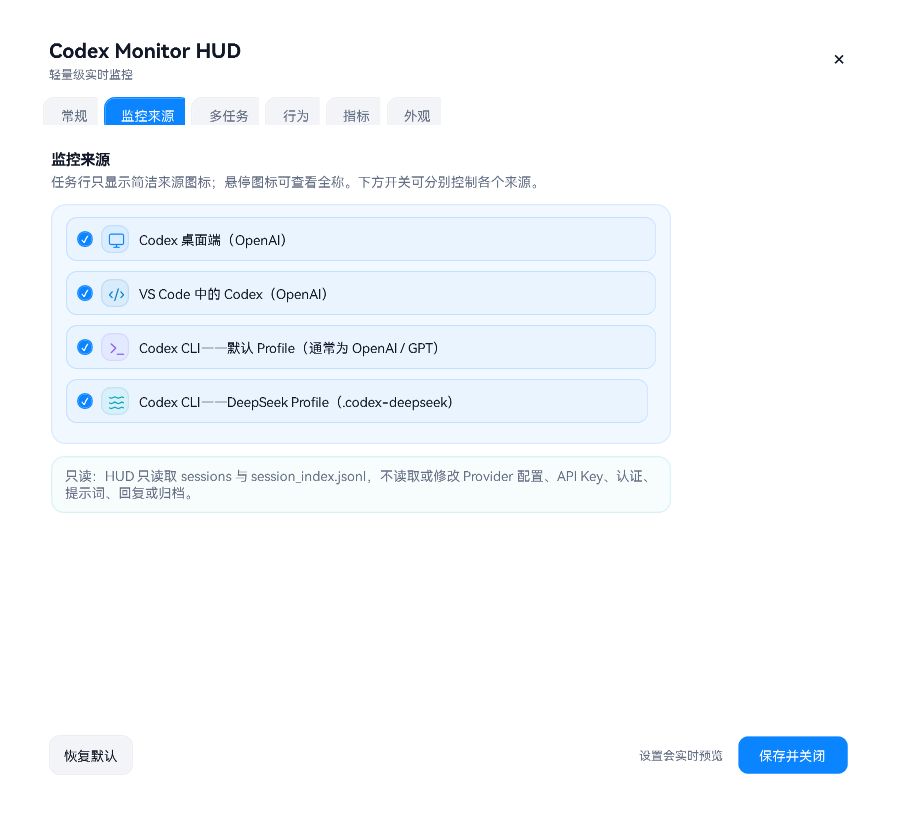

# Codex Monitor HUD

> [English](README.md) · 仅支持 Windows x64

Codex Monitor HUD 是一个完全本地运行的 Windows 实时悬浮监控器：展示当前活跃的 Codex Desktop、VS Code 中的 Codex、普通 Codex CLI（通常是 OpenAI/GPT），以及可选的独立 DeepSeek CLI Profile。它不是聊天记录库、账单工具，也不是云端服务。

## 一句话让 Codex 安装

把本仓库链接交给 Codex，再说一句：**“帮我安装。”**

仓库内的 [INSTALL_WITH_CODEX.md](INSTALL_WITH_CODEX.md) 与 [install-manifest.json](install-manifest.json) 已写好确定性流程。合格的安装代理会识别 Windows x64、优先选择已校验的 Release、保留你的设置、完成健康检查并保留回滚副本；安装时不需要读取对话正文。

手动安装：

```powershell
powershell.exe -NoProfile -ExecutionPolicy Bypass -File .\scripts\install.ps1 -DefaultLanguage zh-CN
```

Windows Release 会随包携带一套私有 .NET/WPF 运行时，因此无需用户预先安装匹配的系统级 .NET；下载体积的大部分来自这套运行时，而不是 HUD 本体。

## 显示什么

- 活跃、监听、空闲、暂停、读取错误、已完成和已中止状态。
- 缓存/未缓存输入、输出、推理输出、本次合计、任务累计、上下文占用、模型和活跃任务数。
- 账号级周额度与 5 小时额度窗口：默认来自 Codex 本地 `rate_limits` 记录，也可选官方本地额度来源。
- 稳定任务编号、工作区标签，以及来自 `session_index.jsonl` 的本地官方对话标题。
- 每个任务编号前都有来源徽标，让桌面端、VS Code、OpenAI CLI 与 DeepSeek CLI 不会混在一起。
- 缓存命中率和上下文占用属于单个任务，因此只放在列表行与独立小气泡中，不会被无意义地加总进汇总栏。每一行使用该任务由 Provider 实际报告的上下文窗口，GPT 与 DeepSeek 的窗口不会混用。
- 可选的公开 API 标价等价成本估算；它会明确标为估算，不是订阅账单或 credits 余额。
- 主气泡宽度可在 360–1600 px 间调整；顶部指标会按可用宽度自动单行或多行，窄列表自动改为两行，右侧操作按钮不会再被挤出。
- 主气泡列表可分别开关目录、开始时间、上下文占用、任务状态（含监听）、模型名称、缓存命中率、本次合计、任务累计、成本估算和数据更新时间。
- 字体可从 Windows 已安装字体中选择，默认优先使用 HarmonyOS Sans SC（鸿蒙字体），并保留中文系统字体回退。
- 可选的任务完成提示音；经过防误报等待后播放一次，除系统通知、醒目提示和经典蜂鸣外，也可浏览选择本地 WAV、MP3、WMA、M4A 或 AAC 文件，并在设置中试听。
- 支持 Windows 原生背景模糊和 Acrylic 亚克力玻璃；染色强度跟随透明度滑块，系统合成不可用时保留半透明回退外观。
- 支持按当前显示器工作区自动吸附到边缘或四角，可关闭并可调吸附距离。
- 来源与操作图标采用 ISC 许可的 [Lucide 免费图标库](https://lucide.dev/) 并以内嵌矢量路径离线显示；归属见 [THIRD_PARTY_NOTICES.md](THIRD_PARTY_NOTICES.md)。


周额度与 5 小时额度不会被猜测，也不会按任务相加。默认显示最新的本地观测值；你可在 **设置 > 额度收尾保护** 开启已登录的官方 Codex 本地接口，它只从普通 Profile 读取这两个百分比，不读取对话、提示词、Provider 配置或凭据。所选来源暂时不可用时，两项都会显示 `--`，不会把另一个账号的旧数字混进来。

## 桌面端、VS Code 与 CLI 来源

三类任务沿用同一套简洁视觉语言，但各自有明确标记：

| 来源 | 徽标 | 监听的本地 Profile |
| --- | --- | --- |
| Codex Desktop | 显示器 | 普通 `CODEX_HOME`（默认 `~/.codex`） |
| VS Code 中的 Codex | 代码括号 | 普通 `CODEX_HOME`（默认 `~/.codex`） |
| Codex CLI · OpenAI | 终端提示符 | 普通 `CODEX_HOME` |
| Codex CLI · DeepSeek | 水平波纹 | `~/.codex-deepseek` |

徽标位于状态点之后、稳定任务编号之前，在主列表和独立小气泡中都会出现。汇总栏可显示各来源数量；**设置 > 监控来源** 可以分别开关四类来源。VS Code 通过它自己的 `codex_vscode` 会话来源识别，不会再被显示为桌面端任务。识别逻辑读取受限的会话元数据，不依赖写死的模型名称列表，因此以后出现新模型时仍能正常监控；只有价格未知时成本显示为 `--`。

桌面端任务可以使用 Codex 本地任务链接。VS Code 和 CLI 任务不会伪装成桌面任务，请从 VS Code 或对应的 CLI Profile 恢复。

原生 Codex CLI 不需要额外配置即可被监控。第二个 `~/.codex-deepseek` 根目录只是面向进阶用户的可选实测隔离约定；当前还不能任意添加其他自定义根目录。建立隔离配置前请先阅读 [Codex CLI 配置与可选 Provider 隔离](docs/CLI_PROFILE_ISOLATION.zh-CN.md)，其中说明了如何避免把凭据写进文件，以及如何随时回到完全不受影响的普通 Profile。

Codex CLI 也可以运行在 WSL 中，同时继续使用原生 Windows HUD。桥接配置通过 `node.exe`、`\\wsl.localhost\...` 主目录覆盖和显式 `WSLENV` 传递，让 Windows 进程真正读到 WSL 会话。详见 [用 Windows HUD 监控 WSL 中的 Codex CLI](docs/WSL_CODEX_CLI.zh-CN.md)。

**可能兼容，但没测：** HUD 监控的是本地 Codex session 记录，而不是某个前端专属 API，所以 Cursor、Windsurf、VS Code Insiders、`codex exec`、官方 SDK，甚至一些自定义 `codex app-server` 客户端都可能已经“碰巧能用”，只是来源徽标可能叫错。维护者懒得把每一种客户端都追着适配；愿意碰运气的话，可以看 [未验证的 Codex 客户端兼容性](docs/UNVERIFIED_CODEX_CLIENTS.zh-CN.md)，里面写了判断依据、目前最可疑的候选、已知误分类风险，以及怎么安全反馈测试结果。

## 三种显示模式

| 模式 | 用途 |
| --- | --- |
| 汇总 | 一只轻量的聚合总气泡。 |
| 列表 | 在主 HUD 中显示稳定编号的任务行；支持行、卡片、轨道三种样式，以及逐字段显示开关和窄宽度自动换行。 |
| 分裂 | 将任务拆成独立、可调整大小的小气泡，最多 12 个。 |

总气泡上的任务数量按钮只负责展开/收起内嵌列表。已经拆出的独立小气泡不会因收起列表而被合并或关闭；只有在 HUD/托盘菜单中明确选择“合并全部任务气泡”才会合并。



## 日常操作

- 点击任务数量，展开或收起主 HUD 内的列表。
- 拆出单个任务，或从 HUD / 通知区域菜单选择“全部分裂”。
- 拖动主 HUD 保存自定义位置；开启自动贴边后会停靠到最近的屏幕边缘或角落。双击主 HUD 打开设置。
- 关闭独立小气泡只会把该气泡合回主 HUD，监控不会中断。主列表中的“移除任务”才会暂时移除当前 HUD 视图中的任务；对应对话开始下一轮时会自动回来。
- 透明度支持 **0% 到 100%**。0% 会让 HUD 故意完全不可见，请用通知区域菜单或设置快捷方式恢复。
- 开启鼠标穿透后，可从通知区域菜单关闭，或直接让 Codex 关闭。

## 隐私与边界

所有处理都留在本机。HUD 只从已启用的本地 Profile 读取显示当前状态所需的受限信息：用量计数、模型/Provider 标签、客户端来源、生命周期事件、工作区末级名、会话 ID 和本地官方标题；不会读取 Provider 配置或认证文件，不会保存提示词、回复、工具输出、原始转录或凭据，也不会修改 Codex 会话文件。可选的官方额度来源仅调用已登录的本地 Codex 客户端读取两个额度百分比；HUD 本身没有遥测，也不会处理凭据。

所有已启用 Profile 合计最多扫描 64 个近期会话文件；重新打开的旧会话按最新写入时间识别。内部/子代理会话和超过保留时间的终态任务不会进入可见列表。

可选的本地 MCP 控制面支持当前 MCP `2025-11-25` 协商及兼容的旧版协议、结构化结果、按来源定位任务、受限动态通知和明确的工具错误。它可以操控 HUD，但不能通过 HUD 读取对话正文。详见 [docs/MCP_INTEGRATION.md](docs/MCP_INTEGRATION.md)。

详见 [PRIVACY.md](PRIVACY.md) 与 [SECURITY.md](SECURITY.md)。

## 平台支持

- **Windows 10/11 x64：** 已支持并提供安装包，包括文档化的 Windows HUD → WSL CLI 桥接。
- **macOS / Linux / 其他架构：** 不提供二进制、安装器、工作流或支持承诺。

本项目已明确放弃 macOS 适配。欢迎 macOS 用户自行基于公开源码进行移植，但本仓库只发布和验证 Windows 版本。

## 当前状态

`3.2.1` 保留 3.2.0 的额度收尾保护和多端监控，并修复 Windows Release 安装路径：即使机器装有 .NET SDK，也会使用随包运行时，不会意外在用户机器上构建源码。可选成本显示仅使用离线的标准 API 标价快照，不是 Codex 积分或订阅账单计算。这是独立、非官方项目，与 OpenAI、Microsoft 或 DeepSeek 均没有隶属或背书关系。

MIT License.
